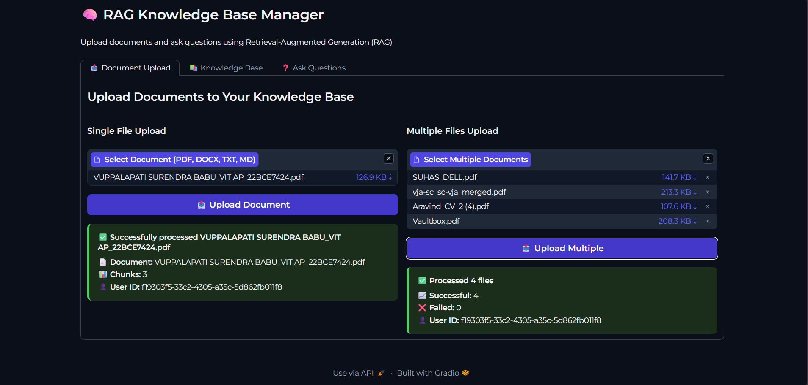
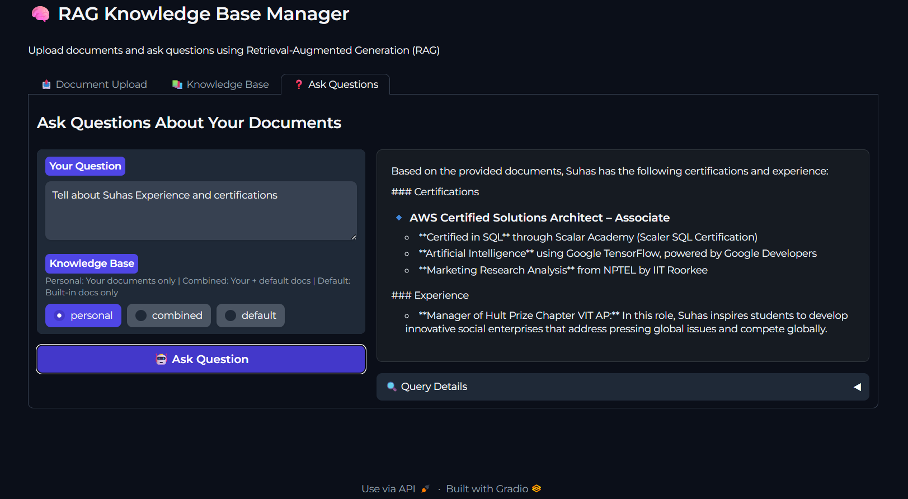

# RAG Knowledge-Based Search Engine

## Overview
Retrieval-Augmented Generation (RAG) system for intelligent document Q&A. Upload documents, ask questions, and get AI-powered answers using Google Gemini. Each user has a private, secure knowledge base.

## Key Features
- **Universal Document Support:** PDF, DOCX, TXT, Markdown
- **Personal Knowledge Bases:** Isolated, user-specific document storage
- **AI-Powered Answers:** Google Gemini integration for intelligent responses
- **Semantic Search:** Vector-based retrieval for contextually relevant results
- **Modern UI:** Responsive web interface with enhanced chat experience
- **Query Expansion:** Advanced retrieval through question paraphrasing

## System Architecture
| Component         | Technology                | Purpose (One Line)                       |
|-------------------|--------------------------|------------------------------------------|
| Backend API       | FastAPI                  | High-performance REST API                |
| Frontend UI       | Gradio                   | Interactive web interface                |
| RAG Pipeline      | LangChain                | Document processing & Q&A                |
| AI Engine         | Google Gemini            | Advanced answer generation               |
| Embeddings        | HuggingFace Transformers | Semantic document encoding               |
| Vector Store      | ChromaDB                 | Efficient similarity search              |
| Document Pipeline | Custom                   | Multi-format text extraction             |

## Data Flow Architecture
                                 ┌─────────────────┐
                                 │  1. Upload PDF  │
                                 │  DOCX, TXT, MD  │
                                 └────────┬────────┘
                                          │
                                          ▼
                                 ┌─────────────────┐
                                 │  2. Extract &   │
                                 │  Chunk Text     │
                                 └────────┬────────┘
                                          │
                                          ▼
                                 ┌─────────────────┐
                                 │  3. Generate    │
                                 │  Embeddings     │
                                 └────────┬────────┘
                                          │
                                          ▼
                                 ┌─────────────────┐
                                 │  4. Store in    │
                                 │  Vector DB      │
                                 └────────┬────────┘
                                          │
                                          ▼
                                 ┌─────────────────┐
                                 │  5. Ask         │
                                 │  Question       │
                                 └────────┬────────┘
                                          │
                                          ▼
                                 ┌─────────────────┐
                                 │  6. Retrieve    │
                                 │  Relevant       │
                                 │  Chunks (RAG)   │
                                 └────────┬────────┘
                                          │
                                          ▼
                                 ┌─────────────────┐
                                 │  7. Generate    │
                                 │  Answer with    │
                                 │  Gemini AI      │
                                 └────────┬────────┘
                                          │
                                          ▼
                                 ┌─────────────────┐
                                 │  8. Return      │
                                 │  Response       │
                                 └─────────────────┘

---
## Screenshots
**User Interface:**



<!-- 
**API Endpoints:**
 -->

## Installation & Setup
**Requirements:** Python 3.10+, Google Gemini API Key

1. Copy `.env-template` to `.env` and add your API key:
   ```
   GOOGLE_API_KEY=your_api_key_here
   ```
2. Create virtual environment and install dependencies:
   ```bash
   python -m venv .venv
   .venv\Scripts\activate
   pip install -r requirements.txt
   ```
3. Start backend:
   ```bash
   python main.py
   ```
4. (Optional) Start GUI:
   ```bash
   python src/ragchallenge/gui/enhanced_main.py
   ```

## API Usage
**Upload Document:**
```bash
curl -X POST "http://localhost:8082/documents/upload?user_id=my-user-123" -F "file=@/path/to/document.pdf"
```

**List Documents:**
```bash
curl -X GET "http://localhost:8082/documents/list/my-user-123"
```

**Ask Question:**
```bash
curl -X POST "http://localhost:8082/generate-answer?user_id=my-user-123" \
  -H "Content-Type: application/json" \
  -d '{"messages": [{"role": "user", "content": "What is the main topic?"}]}'
```

**Delete Document:**
```bash
curl -X DELETE "http://localhost:8082/documents/my-user-123/document.pdf"
```

## Example Workflow
1. Upload document
2. Ask a question
3. Get AI-powered answer

## Troubleshooting
- If answers are missing, check your document upload and API key.
- For PDF errors, try DOCX/TXT or use OCR.

## Author
Venkata Suhas Boddu